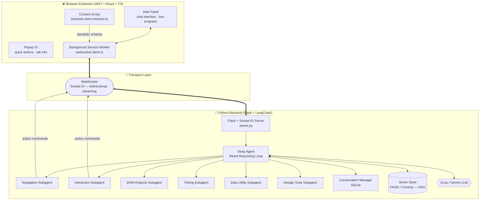
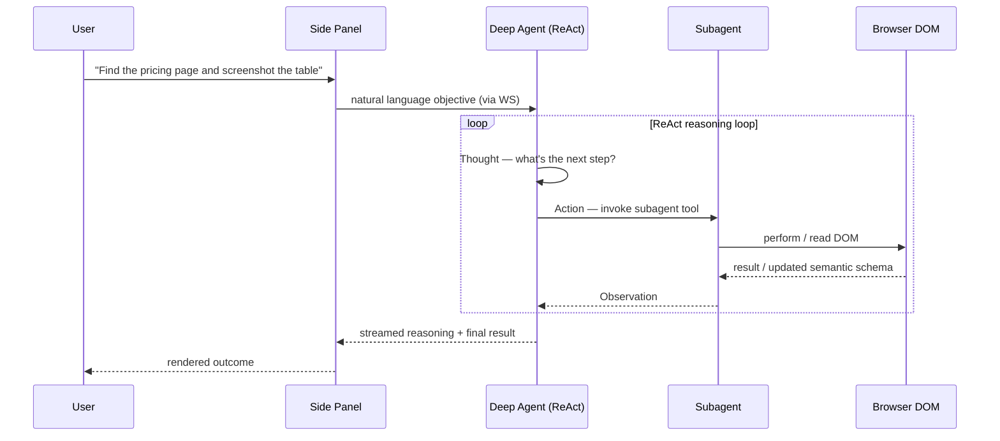

<div align="center">

# ⚡ FlowAgent

### The browser learns to think for itself.

**A ReAct-driven, multi-agent automation engine that turns plain English into real browser action — clicks, forms, navigation, extraction — executed in real time over WebSockets.**

[](https://www.python.org/)
[](https://www.typescriptlang.org/)
[](https://www.langchain.com/)
[](https://flask.palletsprojects.com/)
[](https://wxt.dev/)
[](https://www.docker.com/)

</div>

---

## 🧭 What is FlowAgent?

Most "AI browser assistants" are chatbots bolted onto a sidebar. **FlowAgent is not that.**

It's a full **agentic runtime** that lives between a browser extension and a LangChain-powered reasoning backend, communicating over a persistent WebSocket channel instead of stateless request/response calls. You give it an objective in natural language — *"log into the dashboard, find last month's invoices, and export them"* — and a **Deep Agent** decomposes that objective into a plan, dispatches specialized subagents to execute each step, watches the DOM change in real time, and reports back token-by-token progress to the UI.

The defining engineering bet behind FlowAgent: **DOM understanding should happen on the client, not the server.** Instead of shipping raw HTML across the wire and burning LLM context tokens on parsing markup, a custom semantic extractor runs *inside the page*, distilling the DOM into a compact, meaning-preserving schema before it ever reaches the backend. That single decision is what keeps the agent fast, cheap to run, and respectful of the page owner's data.

---

## 📚 Table of Contents

- [Architecture](#-architecture)
- [The Agent Model](#-the-agent-model)
- [Semantic DOM Extraction](#-semantic-dom-extraction-the-secret-weapon)
- [Memory & Retrieval](#-memory--retrieval-layer)
- [Tech Stack](#️-tech-stack)
- [Getting Started](#-getting-started)
- [Configuration](#️-configuration-reference)
- [Project Structure](#-project-structure)
- [Security Model](#-security-model)
- [Roadmap](#-roadmap)
- [Contributing](#-contributing)

---

## 🏗 Architecture

FlowAgent is a **three-tier real-time system**: a browser-native UI layer, a persistent bidirectional transport, and a stateful agent runtime with its own memory subsystem.



**Why WebSockets instead of REST?** Agent execution isn't a single request — it's a *loop*: think, act, observe, repeat. A socket connection lets the backend stream reasoning steps, tool invocations, and intermediate results to the UI live, and lets the frontend push a **stop signal mid-execution** without waiting for a request to resolve. It also means DOM state changes triggered by one action can be observed and fed back into the next reasoning step with near-zero round-trip overhead.

---

## 🧠 The Agent Model

At the heart of the backend is the **Deep Agent** (`agents/deep_agent.py`) — a LangChain-orchestrated controller running a custom **ReAct (Reason + Act) loop**. Rather than being a monolithic prompt that tries to do everything, it behaves like an engineering lead: it breaks the objective down and *delegates* to specialists.



| Subagent | File | Responsibility |
|---|---|---|
| 🧭 **Navigation** | `navigation_subagent.py` | Opens, closes, focuses tabs; manipulates URLs and browser history |
| 🖱 **Interaction** | `interaction_subagent.py` | Clicks, fills forms, types text, submits data against live DOM elements |
| 🔍 **DOM Analysis** | `dom_analyzer_agent.py` / `page_analysis_subagent.py` | Reasons over the client-extracted semantic schema to locate elements and answer page-state questions |
| ⏱ **Timing** | `timing_subagent.py` | Handles waits, async load detection, and timeouts for dynamically mounted elements |
| 🧮 **Data Utility** | `data_utility_subagent.py` | Formats, summarizes, and shapes large context blocks for the frontend |
| 🔎 **Google Tools** | `google_tools.py` | Pulls in external facts via search APIs when the page alone can't answer the objective |

Every subagent is a **sandboxed tool** in the LangChain sense: it accepts a constrained input, performs one job, and returns a specific string payload — never raw session tokens, never unconstrained system access. The Deep Agent only ever sees what the tool contract exposes.

---

## 🎯 Semantic DOM Extraction — the secret weapon

Traditional browser-automation agents ship the entire rendered HTML to the LLM and hope the tokenizer holds up. FlowAgent flips that:

1. **`semantic-dom-extractor.ts`** runs directly in the content script, inside the live page.
2. It walks the DOM once and produces a **compact semantic schema** — the *meaning* of the page (buttons, inputs, labels, landmarks, interactive affordances) rather than its markup.
3. Only that schema crosses the wire to the backend.

The payoff is threefold:

- **Speed** — no server-side HTML parsing, no headless browser round-trip.
- **Cost** — dramatically fewer tokens spent describing `<div class="…">` soup to the LLM.
- **Privacy** — raw page HTML, cookies, and hidden form data never leave the user's machine unless a subagent explicitly needs to act on them.

---

## 🗄 Memory & Retrieval Layer

FlowAgent's agents are only as good as what they remember, so the system runs two complementary memory stores side by side:

| Store | Technology | Purpose |
|---|---|---|
| **Conversational memory** | SQLite (`conversation_manager.py`) | Durable, structured history of the user ↔ agent exchange |
| **Contextual memory (RAG)** | FAISS or Chroma | Embeds and retrieves DOM context / long-running task history so it never has to be crammed into a single prompt window |

This separation means a long automation session — dozens of tool calls, multiple pages, hours of history — doesn't degrade the agent's reasoning quality. Only the *relevant* slice of memory is retrieved and injected per reasoning step.

---

## 🛠️ Tech Stack

<table>
<tr><td><b>Frontend</b></td><td>WXT (Web Extension Framework) · React · TypeScript · TailwindCSS</td></tr>
<tr><td><b>Backend</b></td><td>Python · Flask · Flask-SocketIO</td></tr>
<tr><td><b>AI / Orchestration</b></td><td>LangChain (ReAct agents) · Groq · Google Gemini</td></tr>
<tr><td><b>Memory</b></td><td>SQLite (conversation state) · FAISS / ChromaDB (vector RAG)</td></tr>
<tr><td><b>Transport</b></td><td>WebSockets via Socket.IO — real-time, bidirectional, streaming</td></tr>
<tr><td><b>Packaging</b></td><td>Docker Compose (backend) · pnpm build (extension bundle)</td></tr>
</table>

---

## 🚀 Getting Started

### Prerequisites

- **Python 3.11+**
- **Node.js 18+** (pnpm recommended — a lockfile is committed for it)
- **Chrome, Edge, or Brave** (any Chromium-based browser)
- An API key for at least one LLM provider (**Groq** and/or **Google Gemini**)

### Option A — Docker (recommended for the backend)

```bash
# 1. Populate backend/.env with your API keys (see Configuration below)
docker-compose up -d --build
```

> The backend comes up on `http://localhost:5000`, speaking WebSockets. FAISS indexes and the SQLite conversation store are persisted automatically to `./backend/data`.

### Option B — Run the backend locally

```bash
cd backend
python -m venv venv

# Windows
venv\Scripts\activate
# macOS / Linux
source venv/bin/activate

pip install -r requirements.txt

# One-time context-optimization setup script
# Windows
.\scripts\setup_context_optimization.bat
# macOS / Linux
bash ./scripts/setup_context_optimization.sh

python server.py
```

### Launch the extension

```bash
cd frontend
pnpm install
pnpm dev
```

> WXT compiles the extension and boots a dedicated Chromium profile with it pre-loaded — no manual "load unpacked" step required during development.

### Production build

```bash
cd frontend
pnpm build
```

Outputs a distributable bundle to `.output/` (or `dist/`) that you can side-load via `chrome://extensions` or ship to the Chrome Web Store.

---

## ⚙️ Configuration Reference

Create `backend/.env`:

```dotenv
# --- Server ---
PORT=5000
HOST=0.0.0.0

# --- LLM Providers (configure at least one) ---
GROQ_API_KEY=your_groq_api_key_here
GOOGLE_API_KEY=your_google_api_key_here

# --- Optional: external search for the Google Tools subagent ---
SERPAPI_KEY=your_serp_provider_key_here
```

| Variable | Required | Description |
|---|---|---|
| `PORT` | No (default `5000`) | Port the Flask + Socket.IO server binds to |
| `HOST` | No (default `0.0.0.0`) | Bind address |
| `GROQ_API_KEY` | Conditional | Enables Groq-hosted LLMs for the ReAct loop |
| `GOOGLE_API_KEY` | Conditional | Enables Gemini as the reasoning model |
| Vector DB deps | — | `langchain-community`, `langchain-chroma` (or `faiss-cpu`), `sentence-transformers` — declared in `requirements.txt`; index directories (`faiss_db`, `chroma_db`) are created automatically under `backend/data/` on first run |

---

## 📁 Project Structure

```text
FlowAgent/
├── backend/
│   ├── server.py                       # Flask + Socket.IO entrypoint
│   ├── routes/
│   │   └── api_routes.py               # REST endpoints (history fetch/clear, etc.)
│   ├── handlers/
│   │   └── websocket_handlers.py       # Socket.IO event registration & dispatch
│   ├── generator/
│   │   └── conversation_manager.py     # Conversation state orchestration (SQLite)
│   ├── agents/
│   │   ├── deep_agent.py               # Core ReAct orchestrator
│   │   ├── agent.py                    # Base agent primitives
│   │   ├── navigation_subagent.py
│   │   ├── interaction_subagent.py
│   │   ├── dom_analyzer_agent.py
│   │   ├── page_analysis_subagent.py
│   │   ├── timing_subagent.py
│   │   ├── data_utility_subagent.py
│   │   └── google_tools.py
│   ├── utils/ & config/                # Env management, token accounting, shared config
│   └── data/                           # Auto-generated SQLite + vector indexes
├── frontend/
│   ├── background.ts                   # Service worker — orchestration hub
│   ├── content.ts                      # Injected into the active page
│   ├── semantic-dom-extractor.ts       # Client-side DOM → schema compiler
│   ├── websocket-client.ts             # Persistent backend connection
│   ├── sidepanel/                      # AgentExecutor.tsx, ChatInterface.tsx, etc.
│   └── popup/                          # Quick actions, tab info, settings
├── docs/
│   ├── ARCHITECTURE.md
│   ├── SETUP.md
│   └── AGENTS.md
├── docker-compose.yml
└── requirements.txt
```

---

## 🔒 Security Model

FlowAgent operates with real, live control over a user's browser — so its trust boundaries are deliberate, not incidental:

- **Tool sandboxing** — every subagent is a constrained LangChain tool. It receives a narrow input contract and returns a specific string payload; it cannot reach outside its declared scope.
- **No indiscriminate credential passing** — session tokens and sensitive cookies are never blanket-forwarded to the LLM or between agents.
- **Client-side DOM privacy** — full page HTML never leaves the browser; only the distilled semantic schema does.
- **Mid-execution interrupt** — a stop control in the side panel can halt the ReAct loop *while it is running*, over the same WebSocket channel used to drive it — critical for an agent with real write access to a page.
- **Explicit state ownership** — all cross-agent state flows through a single `conversation_manager.py`, avoiding hidden, implicit shared state between subagents.

---

## 🗺 Roadmap

- [ ] Multi-tab parallel task execution (fan-out objectives across tabs)
- [ ] Pluggable LLM router (auto-select Groq vs. Gemini by task complexity / cost)
- [ ] Visual action replay — step-through debugger for agent decisions
- [ ] Firefox / Manifest V2 compatibility pass
- [ ] Signed, permissioned "recipes" — shareable, reviewable automation scripts
- [ ] Fine-grained per-site permission model

---

## 🤝 Contributing

FlowAgent is structured as a monorepo specifically to keep contribution friction low:

- `frontend/` owns everything touching Chrome Extension APIs and the React UI.
- `backend/` owns LLM orchestration, agent logic, and the vector/relational memory layer.

Fork it, branch off `Integration`, and open a PR. If you're extending the agent system, start with `docs/AGENTS.md` — new capabilities are almost always best expressed as a new subagent tool rather than by expanding the Deep Agent's core prompt.

---

## 📄 License

No license file is currently published in this repository — until one is added, all rights are reserved by default. If you intend for others to fork, modify, or ship this commercially, add a `LICENSE` file (MIT is a common choice for projects like this) so contributors know exactly where they stand.

---

<div align="center">

**Built for developers who think the browser should understand intent, not just accept input.**

</div>
