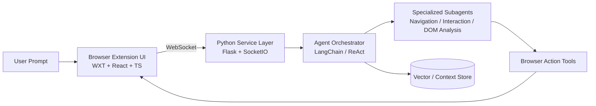

# FlowAgent

<div align="center">


**A production-oriented AI browser extension platform for autonomous web navigation and task execution with a TypeScript frontend and Python agent backend.**

</div>

---

## Table of Contents

- [Overview](#overview)
- [Core Capabilities](#core-capabilities)
- [System Architecture](#system-architecture)
- [Technology Stack](#technology-stack)
- [Repository Layout](#repository-layout)
- [Getting Started](#getting-started)
  - [Prerequisites](#prerequisites)
  - [Environment Setup](#environment-setup)
  - [Run with Docker (Recommended)](#run-with-docker-recommended)
  - [Run Backend Locally](#run-backend-locally)
  - [Run Frontend Extension](#run-frontend-extension)
- [Configuration](#configuration)
- [Development Workflow](#development-workflow)
- [Testing & Quality Gates](#testing--quality-gates)
- [Operational Readiness](#operational-readiness)
- [Security Practices](#security-practices)
- [Project Documentation](#project-documentation)
- [Contributing](#contributing)
- [Roadmap](#roadmap)
- [License](#license)

---

## Overview

**FlowAgent** is a full-stack, AI-powered browser automation platform that enables users to execute complex web tasks through natural-language instructions.

The system combines:
- a **React + WXT extension frontend** for in-browser interaction,
- a **Python backend** for orchestration and agent execution,
- and a **real-time WebSocket channel** for low-latency command/response flows.

The architecture is designed for practical production use cases: deterministic orchestration, fast client-side page understanding, and extensible agent/tool pipelines.

---

## Core Capabilities

- **Natural-Language Task Execution**  
  Convert high-level user prompts into structured browser actions.

- **Agentic ReAct Loop**  
  Plan → reason → act cycles with support for specialized sub-agents.

- **Real-Time Browser Control**  
  Bi-directional WebSocket communication between extension and backend runtime.

- **Context-Aware Decisioning**  
  Uses semantic extraction and optional RAG layers to improve action quality.

- **Monorepo Productivity**  
  Unified frontend/backend development with clear service boundaries.

---

## System Architecture



### Architectural Principles

1. **Low-latency control loop** for responsive browser interactions.
2. **Separation of UI, orchestration, and execution concerns** for maintainability.
3. **Extensibility-first agent design** to support new tools and providers.
4. **Operational transparency** with logs, deterministic fallbacks, and health-aware services.

---

## Technology Stack

| Domain | Technologies |
|---|---|
| Frontend Extension | WXT, React, TypeScript, TailwindCSS |
| Backend Runtime | Python, Flask, Flask-SocketIO |
| Agent Framework | LangChain, Groq / Gemini |
| Retrieval / Context | FAISS / ChromaDB (project-dependent) |
| Communication | WebSockets |
| Packaging / Ops | Docker, shell/batch scripts |

Repository language composition (approx.):
- **TypeScript**: 50.4%
- **Python**: 46.1%
- **CSS**: 2.7%
- **Shell/Batch/HTML/Dockerfile**: remaining share

---

## Repository Layout

```text
FlowAgent/
├── frontend/                 # WXT + React extension UI and browser integration
├── backend/                  # Python runtime, APIs, orchestrator, and agent logic
├── docs/                     # Architecture, setup, and agent documentation
├── docker-compose.yml        # Local multi-service orchestration
├── README.md                 # Project entry documentation
└── ...
```

---

## Getting Started

### Prerequisites

- **Node.js** 18+
- **pnpm** (recommended for frontend package management)
- **Python** 3.11+
- **Docker Desktop** (recommended path)
- **Git**

### Environment Setup

1. Clone repository:

```bash
git clone https://github.com/Himaanshuuuu04/FlowAgent.git
cd FlowAgent
```

2. Create backend environment file:

```bash
cp backend/.env.example backend/.env
```

3. Configure required secrets (example keys):
- `GROQ_API_KEY` or provider-specific key
- any model/router keys your selected setup requires

---

### Run with Docker (Recommended)

```bash
docker-compose up -d --build
```

Backend endpoint: `http://localhost:5000` (WebSocket-enabled)

Persistent state (e.g., SQLite/FAISS) is stored under `backend/data`.

---

### Run Backend Locally

```bash
cd backend
python -m venv venv

# Windows
venv\Scripts\activate

# macOS/Linux
source venv/bin/activate

pip install -r requirements.txt

# Context optimization setup
# Windows
.\scripts\setup_context_optimization.bat

# macOS/Linux
bash ./scripts/setup_context_optimization.sh

python server.py
```

---

### Run Frontend Extension

```bash
cd frontend
pnpm install
pnpm dev
```

WXT will build the extension and launch a Chromium profile for debugging.

---

## Configuration

Typical runtime configuration categories:

- **LLM Provider**: model/provider keys and defaults
- **Backend Runtime**: host/port, CORS, WebSocket settings
- **Data Layer**: vector DB paths, persistence config
- **Execution Controls**: timeout limits, retry policy, safety constraints

Keep all sensitive values in environment files or secret managers. Never commit secrets.

---

## Development Workflow

1. Create a branch:
   ```bash
   git checkout -b feat/<feature-name>
   ```
2. Implement small, testable changes.
3. Run frontend and backend checks before opening PR.
4. Document behavior or interface changes under `docs/`.
5. Open PR with context, risk notes, and validation evidence.

---

## Testing & Quality Gates

Use project scripts where available:

```bash
# Frontend
cd frontend
pnpm lint
pnpm test

# Backend
cd ../backend
pytest -q
```

Recommended CI pipeline controls:
- Lint + formatting checks
- Type safety / static analysis
- Unit + integration tests
- Dependency vulnerability scans
- Build/package verification

---

## Operational Readiness

For production-like deployments, ensure:

- Structured logs with request/session correlation IDs
- Metrics for task success rate, latency, retries, and failures
- Health/readiness probes for backend services
- Controlled rollout strategy (canary/blue-green where possible)
- Alerting tied to SLOs (latency + success-rate thresholds)

---

## Security Practices

- Enforce **least privilege** for API keys and runtime tokens.
- Validate all agent tool inputs/outputs.
- Apply request rate limits and execution timeouts.
- Keep dependencies updated and scanned.
- Protect user/browser context data under explicit retention policy.

---

## Project Documentation

Detailed docs are in [`docs/`](docs):

- [`ARCHITECTURE.md`](docs/ARCHITECTURE.md) – service and communication design
- [`SETUP.md`](docs/SETUP.md) – setup, env, and local runbook
- [`AGENTS.md`](docs/AGENTS.md) – orchestrator/sub-agent behavior and responsibilities

---

## Contributing

Contributions are welcome and encouraged.

1. Open an issue describing the change or bug.
2. Keep PRs focused and reviewable.
3. Include tests for behavior changes.
4. Update docs whenever interfaces or flows change.
5. Ensure CI checks pass prior to requesting review.

---

## Roadmap

- [ ] Stronger multi-agent planning policies
- [ ] Expanded tool/plugin surface for browser actions
- [ ] Improved replay/debug trace visualization
- [ ] Enhanced safety rails for high-impact actions
- [ ] Performance optimization for long-horizon workflows

---

## License

This project is licensed under the **MIT License**.

If not already present, add a `LICENSE` file with MIT terms.
